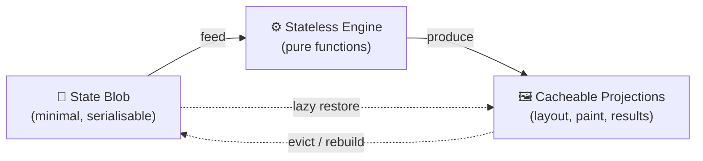
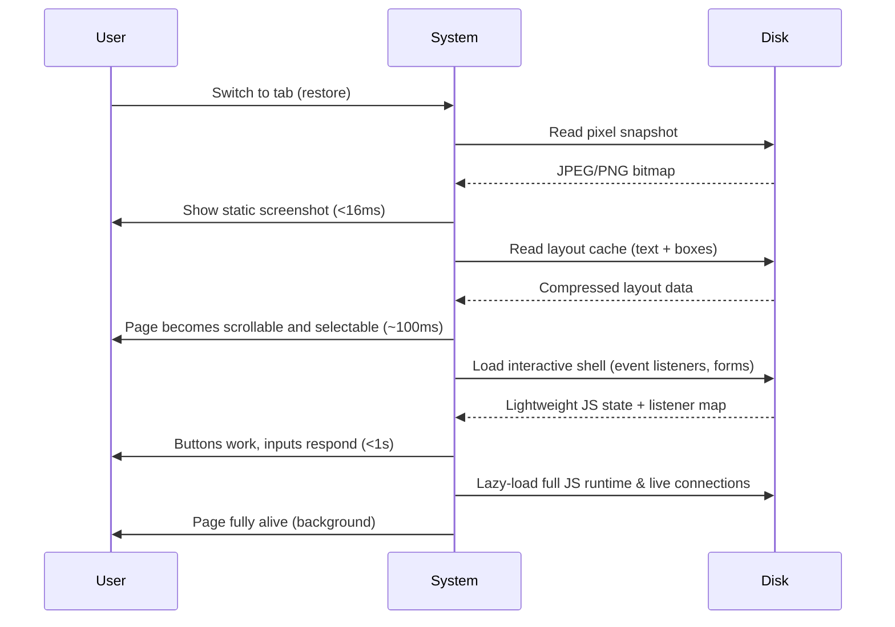
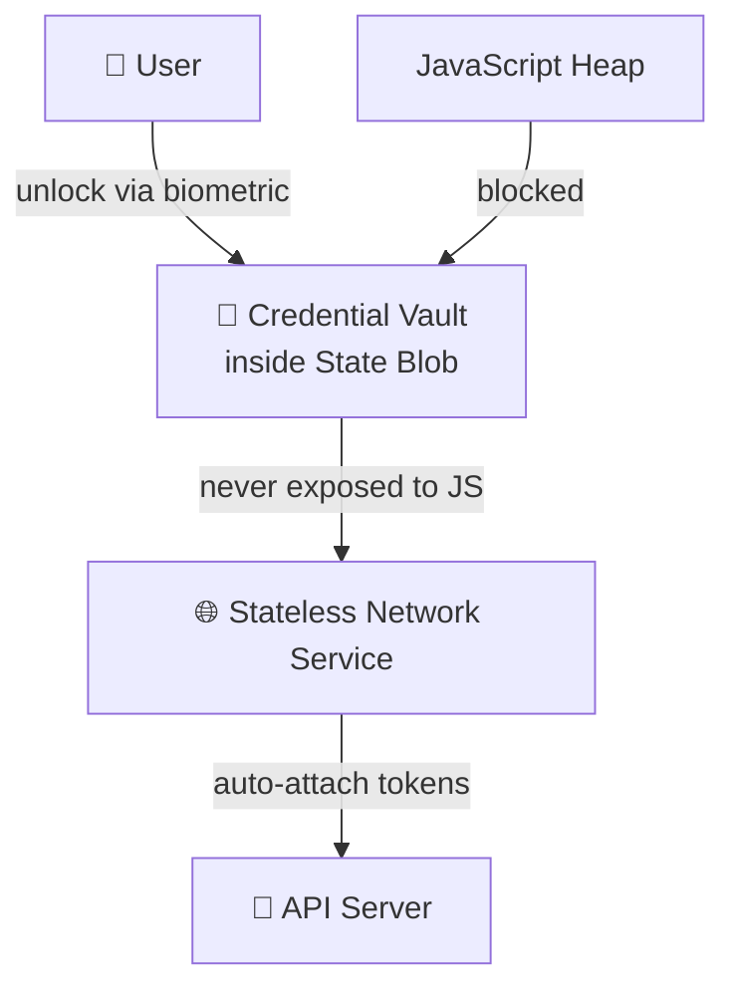
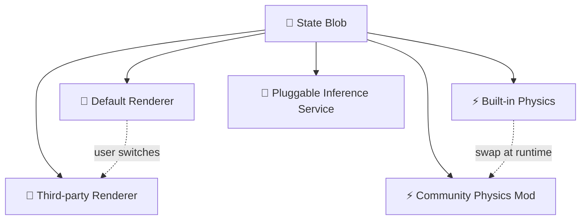
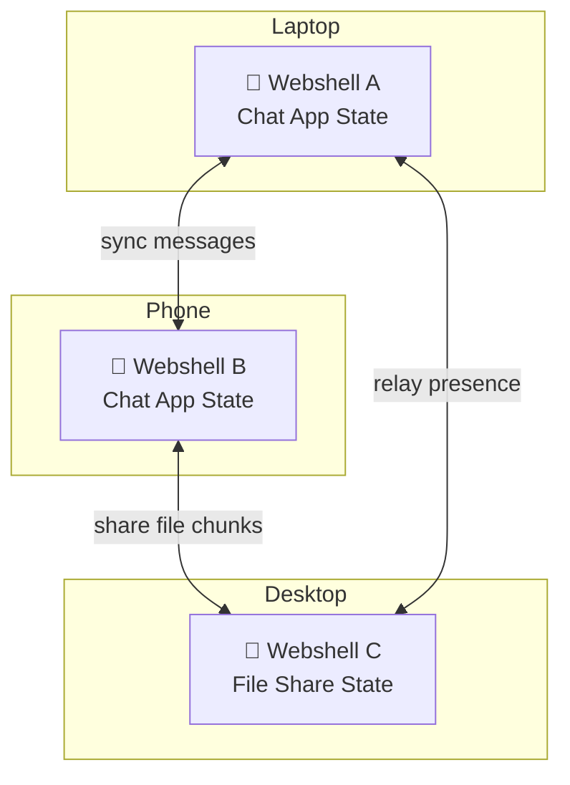
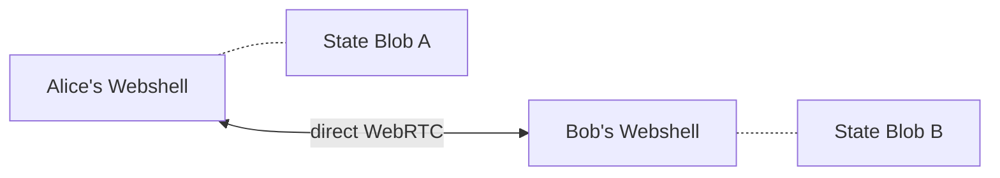
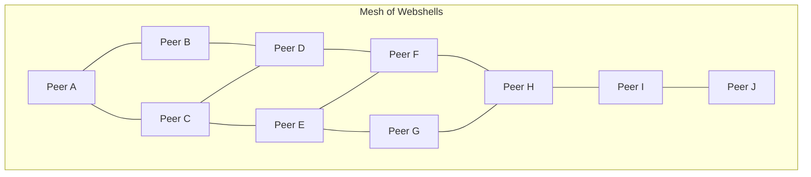
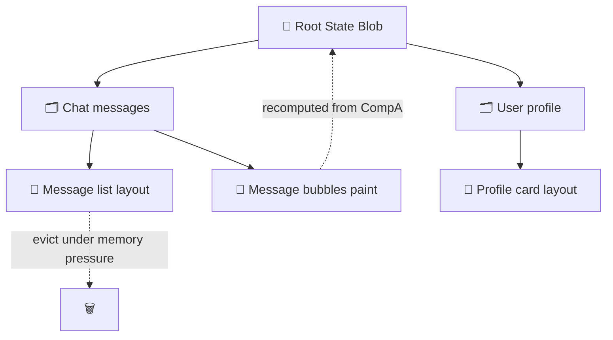
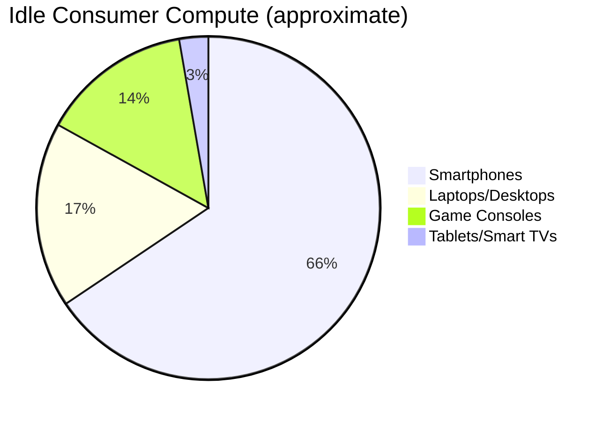
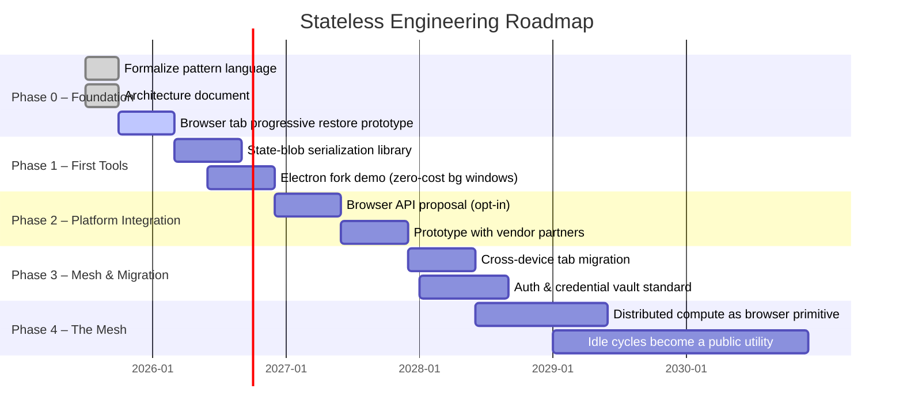

<!--
  Stateless Engineering — Organization README
  The discipline of pure-state system design. Manifesto, explained, with diagrams and a live demo: Bitchat.
-->

<div align="center">
  
  <p><em>A discipline for building systems where state is truth and engines are pure function.<br>Hibernate anything. Restore progressively. Waste nothing.</em></p>
</div>

---

## The Problem

Modern software **welds state to engines**.  
A browser tab you opened three days ago still holds every pixel, layout box, and JavaScript closure in memory, even though you haven’t looked at it.  
A serverless function keeps a warm runtime alive just in case a request arrives.  
A desktop application’s background window still consumes hundreds of megabytes for a document you aren’t editing.

We treat **live processes** as the default. Hibernation is an afterthought, and when it exists it’s all‑or‑nothing.  
The system cannot tell the difference between what is essential and what can be thrown away and rebuilt later.

> **This is the largest missed architectural optimisation of our generation.**  
> It wastes memory, CPU cycles, battery life, and the hardware billions of people rely on every day.

---

## The Core Principle

Every interactive system can be decomposed into exactly two things:

1. **A state blob** — the minimal, serialisable representation of everything the system *is*.  
2. **Stateless services** — pure functions that take a state blob and produce output (rendering, physics, network responses, AI inference, …).

**Everything else** — layout caches, compositor layers, warm connections, materialized views, GPU textures — is a **cacheable projection** of the state blob.



State Blob in Pseudocode

A state blob is just a plain data structure that can be serialised:

```javascript
// The minimal truth of a chat app
const chatStateBlob = {
  messages: [
    { id: 1, text: "Hey!", sender: "alice", timestamp: 1712345678 }
  ],
  draft: "Hello, world",
  scrollPosition: 450
};

// Serialise to store, send over network, or write to disk
const savedBlob = JSON.stringify(chatStateBlob);
localStorage.setItem('chat_snapshot', savedBlob);

// Later, restore from the blob
const restored = JSON.parse(localStorage.getItem('chat_snapshot'));
// Render using the stateless UI service
renderUI(restored);
```

When you hibernate, you keep only this blob. When you resume, you pass it back to the stateless renderer.
Everything the user sees is a pure function of this state.

---

Key Concepts

Progressive Restoration

Like a progressive JPEG, a system should become useful immediately and then sharpen over time.



Pseudocode for a progressive restore orchestrator:

```javascript
async function progressiveRestore(tabId, stateBlob) {
  // Pass 0: show immediate pixel cache
  const bitmap = await loadFromDisk(`/tabs/${tabId}/snapshot.png`);
  showBitmapOverlay(bitmap);

  // Pass 1: hydrate text and layout
  const layout = await loadFromDisk(`/tabs/${tabId}/layout.bin`);
  applyLayout(layout);          // replaces bitmap with real text, keeps scroll position
  enableScrolling();

  // Pass 2: interactive shell
  const shellState = await loadFromDisk(`/tabs/${tabId}/shell.json`);
  attachEventListeners(shellState.listeners);
  restoreFormFields(shellState.forms);

  // Pass 3: full JavaScript heap and network connections
  scheduleIdleTask(async () => {
    await loadJSHeap(`/tabs/${tabId}/heap.snapshot`);
    reconnectWebSockets(shellState.sockets);
    removeBitmapOverlay();   // seamless handoff
  });
}
```

---

The State Blob as a Secure Boundary

Because the state blob is the source of truth, the runtime can treat it as a protected compartment.



Pseudocode for a secure fetch using the vault:

```javascript
// Application code does NOT see the token
async function getProfile() {
  // The stateless network service reads the token from the vault
  const response = await secureFetch('/api/profile', {
    credentials: 'vault'  // browser-managed authentication
  });
  return response.json();
}
```

The actual token lives only inside the encrypted state blob, never in JavaScript memory.
XSS cannot steal what it cannot see.

---

Modularity & Moddability

When every service is stateless and state is a portable blob, the architecture becomes inherently modular.
Components can be swapped, upgraded, or even user‑customised without touching application code.



Examples of what this unlocks:

· Custom UI skins and layouts: The rendering service is just a function; users can install alternative renderers that interpret the same state blob differently (e.g., a high‑contrast accessibility view, or a terminal‑style interface for a chat app).
· Game mods at engine level: Physics, AI, and audio can be replaced with community‑built services. A game’s state blob (world + rules) stays untouched; the simulation behaviour changes by swapping services.
· Browser extensions that are true peers: Instead of injecting scripts into a page, an extension can run as a stateless service that observes and transforms the state blob through a well‑defined API – safer and more powerful.
· Version‑independent state: Because the state blob is the only source of truth, an application’s data can survive complete engine rewrites. Upgrade your renderer, swap your physics engine, and your state remains intact and meaningful.

This makes software moddable by default, without the developers having to explicitly build a plugin system.

---

Security & Expected Behaviour Perks of Statelessness

Separating state from execution yields deterministic, auditable, and trustworthy behaviour.

1. Determinism & Reproducibility
Given the same state blob and the same service versions, the output is identical. This means:

· Bugs can be reliably reproduced and fixed.
· Cross‑device behaviour is consistent – no “works on my machine”.
· Time‑travel debugging becomes trivial: record a sequence of state blobs, replay them through any service version.

2. Crash Resilience & Zero Data Loss
If a stateless service crashes (e.g., the renderer), the state blob is untouched. A new service instance picks up the blob and resumes instantly. The user never loses their work, and the system never needs to rebuild complex state from scratch.

3. Enforced Security Boundaries
All side effects (network, storage, GPU) go through stateless services that can be audited and restricted. No page script can reach outside the state blob without passing a controlled interface. This eliminates whole classes of exploits – prototype pollution, arbitrary code execution via DOM clobbering, and the tangled trust assumptions of a retained DOM.

4. Clean Shutdown & Restart
Hibernation is not a special case; it’s just serialising the state blob and killing the services. Restoration is the reverse. There is no “partially open” state, no dangling file handles, no risk of corruption from an unclean exit.

5. Predictable Resource Usage
An idle tab consumes zero CPU and only the storage of its blob. A background window cannot silently chew through battery. Users and the OS can trust the runtime to stay quiet.

---

Every Client Is a Server (Webshells)

A tab holding a state blob and calling stateless services is no longer a passive document viewer.
It’s a webshell — a portable, lightweight peer on the network.



Webshells can serve content, participate in a distributed mesh, lend idle compute, and synchronise state directly with peers — without a central server.

---

Mesh in Action: Bitchat (a small‑scale demo)

Bitchat is a peer‑to‑peer chat application built entirely on the Stateless Engineering principles.
Each participant runs a webshell; the only state is the message history (a CRDT‑backed state blob).
No server, no accounts, no central storage.

Small mesh (two peers):



Each side keeps a local state blob. Messages are exchanged as operations (insert, delete) over a data channel. The renderer is a pure function of the blob.

```javascript
// Alice's webshell, simplified
class BitchatWebshell {
  constructor() {
    this.stateBlob = { messages: [] }; // the truth
    this.peers = new Map();            // connected webshells
  }

  // A user sends a message
  sendMessage(text) {
    const op = { type: 'insert', id: uuid(), text, sender: 'alice', time: Date.now() };
    this.apply(op);               // update local blob
    this.broadcast(op);           // send to all peers
  }

  apply(op) {
    this.stateBlob.messages.push(op);
    renderUI(this.stateBlob);     // pure function, no retained DOM
  }

  broadcast(op) {
    for (const peer of this.peers.values()) {
      peer.send(JSON.stringify(op));
    }
  }
}
```

Larger mesh (ten peers, with relay):



Every peer is equal. If one disappears, the state is replicated elsewhere.
A new peer can join and receive the full state blob from any connected node, then progressively hydrate the chat history.

Hibernation of a Bitchat participant:
When you close the tab, the webshell serialises its state blob (the message history) to disk.
On reopening, it restores the messages instantly from the blob, reconnects to the mesh, and fetches any missing operations.
There is no “loading” screen — the chat is there, and new messages arrive as the connections come alive.

---

Cached at Any Node, at Any Depth

Because the system models its own object tree as state + derivations, it can cache any node independently.



Pseudocode for a subsystem that caches its output:

```javascript
class LayoutCache {
  constructor() {
    this.cache = new Map(); // key: state hash, value: layout tree
  }
  get(stateHash) {
    return this.cache.get(stateHash);
  }
  set(stateHash, layoutTree) {
    this.cache.set(stateHash, layoutTree);
  }
  evict(predicate) {
    for (const [key, value] of this.cache) {
      if (predicate(key, value)) this.cache.delete(key);
    }
  }
}

// Usage: after rendering, store the layout
const layout = computeLayout(stateBlob);
layoutCache.set(hash(stateBlob), layout);
// On eviction, the layout is gone but can be regenerated from the state blob.
```

---

Democratization of Compute

The biggest hidden resource in the world is the idle silicon already sitting in people’s pockets and on their desks.
Phones, laptops, game consoles, and smart TVs collectively contain an estimated 1.8 exaFLOPS of unused compute capacity — comparable to the world’s fastest supercomputer, running 24/7 for free.



Under the Stateless Engineering model, every webshell can offer its spare cycles as a stateless compute service.
A heavy AI inference, a protein folding simulation, a weather model — any of these can be split across thousands of idle browser tabs, with results fed back to the requester.

This transforms computing from a scarce, centralised resource controlled by cloud providers into a democratised public utility.
Anyone with a browser can:

· Contribute compute to global research projects.
· Consume massive parallel processing without owning a server.
· Monetise idle hardware by renting it to the mesh (opt‑in, privacy‑preserving).
· Collaborate on real‑time simulations with peers directly, no central server needed.

The barrier to entry for high‑performance computing falls to zero.
Distributed computing stops being a special setup and becomes the default platform — and it starts with a simple architectural shift inside the browser.

---

The Benefits

Dimension Before (retained‑state monolith) After (Stateless Engineering)
Memory One tab = 100–500MB live. Thousands of tabs impossible. One tab = 5–50MB state + on‑demand caches. 10,000 tabs in the background.
CPU / Energy Background tabs run timers, recalc styles, wake the CPU. Hibernated tabs use zero CPU; work only for visible outputs.
Restore Speed Reload from network or wake full process — seconds to minutes. First paint in <16ms from cached bitmap; full interactivity in <1s.
Security XSS exposes raw tokens from JavaScript heap. Tokens encrypted inside state blob, never exposed to JS.
Modularity Monolithic engine, impossible to swap parts. Stateless services are pluggable; users and devs can customise every layer.
Distribution Compute lives on centralised servers. Idle compute is a mesh resource; every peer contributes and consumes.
Democratization High‑performance computing is expensive and gated. Any device with a browser joins a global supercomputer.
Hardware Demands constant RAM upgrades. Even 4GB devices run modern workloads comfortably.

---

Applications

🌐 Browsers

Background tabs become kilobyte‑sized state blobs on disk. Tab switching feels instantaneous.
A $200 Chromebook keeps hundreds of tabs open without swapping.

💻 Desktop Apps (Electron / Tauri)

Every window is a state blob. Minimised windows free their renderer entirely.
On quit, the workspace is serialised; on relaunch, all windows appear exactly as they were.

☁️ Serverless & Edge Compute

Cold starts drop to microseconds. A function is a state blob loaded into a pre‑warmed stateless runtime.
Instance density soars, cloud costs plummet.

🎮 Games

World state is a synchronised state blob across a mesh of player webshells. Rendering, physics, and AI are shared stateless services.
No dedicated server — the players’ own webshells run the simulation.

🤖 AI Inference

A model is a stateless service. The conversation state is a blob.
A million concurrent chat sessions share one GPU‑backed engine; only active sessions occupy compute.

🗨️ Mesh Chat & Beyond

Bitchat demonstrates that even a trivial chat app becomes resilient, instant‑on, and serverless when built as a webshell.
The same pattern scales to collaborative editors, social networks, and distributed operating systems.

---

The Bigger Picture

The world has 1.8 exaFLOPS of idle consumer compute sitting in phones, laptops, and consoles right now — equivalent to the fastest supercomputer ever built, dissipated as heat.

Stateless Engineering turns that idle capacity into a planetary‑scale mesh where every device can contribute and consume.
Distributed computing stops being a special setup and becomes the default platform.
The web becomes a living, breathing, peer‑to‑peer operating system — and it starts with a simple architectural shift inside the browser.

---

Our Mission

We believe the boundary between state and engine is the most important interface in software — and that making it explicit, serialisable, and cacheable unlocks a faster, safer, and more equitable computing future.

stateless-engineering exists to:

· Define the pattern language of state‑driven system design.
· Build reference implementations that prove the model works.
· Create libraries, tools, and specifications that others can adopt.
· Advocate for a web where every tab is a hibernate‑able, mesh‑capable webshell.

---

How to Contribute

This is an open, community‑driven effort. You don’t need a PhD in browser internals — just a willingness to think rigorously about state.

We need:

· Engineers to prototype state‑blob systems for browsers, Node.js, and WASM.
· Standards folks to draft APIs and protocols (credential compartments, progressive restore, mesh state sync).
· Technical writers to document patterns, case studies, and migration guides.
· Security researchers to harden the state blob boundary.
· Dreamers to imagine what becomes possible when compute is free and fluid.

Start by reading the Architecture Overview, then check the Roadmap and open an issue to introduce yourself.

---

Roadmap



The pieces are already there. We just need to connect them.

---

License

All original work in this organization is released under CC0 1.0 Universal or MIT License unless otherwise noted.
Ideas should spread freely.

<div align="center">
  <br>
  <p><strong>Stateless Engineering</strong> — because the future of computing shouldn’t be a memory hog.</p>
</div>
